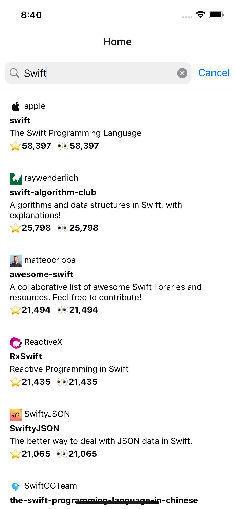
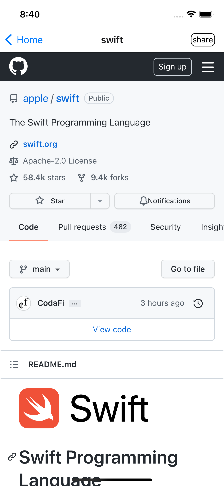

FindGitHubRep_ReactNative
===

- GitHubのレポジトリを検索するアプリです

## 目的

- APIで情報取得してリスト表示するといった、アプリの基本機能をあの言語・フレームワークで書くとどうなるんだろうか、と思った練習用アプリです。
	- 本レポジトリは、React Native で作ったら、です
- GitHubのレポジトリ検索は、制約があるが、認証なしで使えるので、token 管理などが不要なため選択した。

| main | detail|
| :-: | :-: |
|  |  |

## 開発環境

- Node.js
	- 16.13.0


```shell
% yarn
% yarn start
% yarn pod
% yarn ios
% yarn android
```

## 選定アーキテクチャ

- Redux Saga
